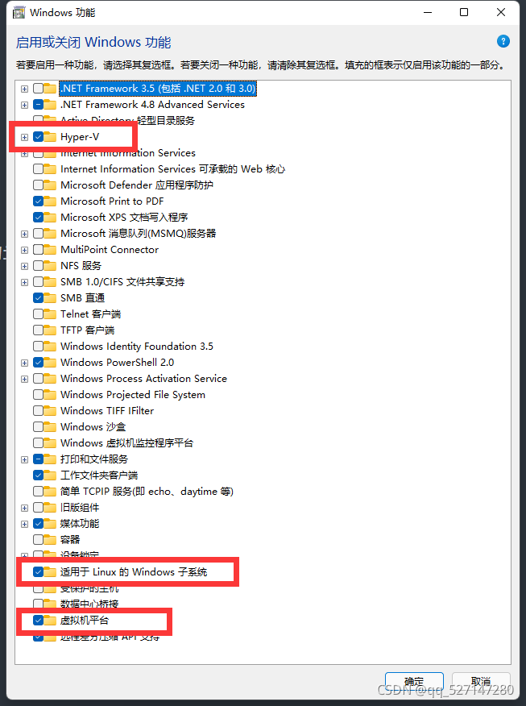
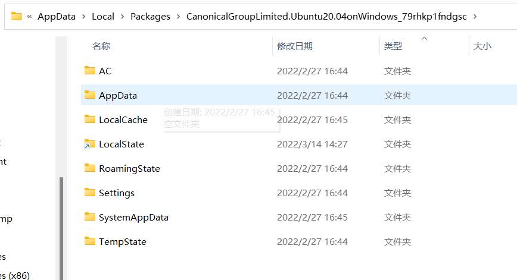
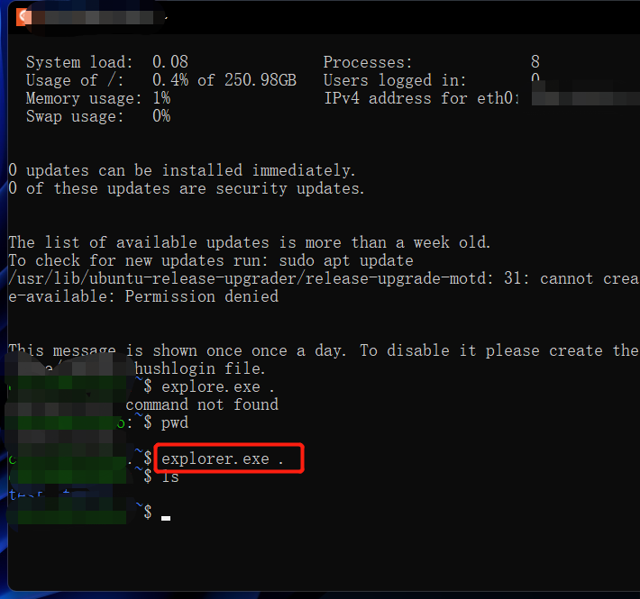

# win11安装Linux子系统指南
##### (学习时间：2022-02-27)
## 目录
+ [一、安装](#安装步骤)
+ [二、账户设置](#账户设置)
+ [三、迁移子系统镜像位置](#迁移子系统镜像位置)
+ [四、window系统访问子系统文件目录](#window系统访问子系统文件目录)

参考windows官方安装指南: [安装WSL](https://docs.microsoft.com/zh-cn/windows/wsl/install "安装WSL")


### 安装步骤
一、打开`任务管理器`, 检查虚拟化是否开启,如下图所示：


二、打开 控制面板-程序和功能 , 找到 启动或关闭Windows功能, 确认以下功能是否安装
```
Hyper-V
适用于 Linux 的 Windows 子系统
虚拟平台
```



我的电脑是windwos11没有Hyper-V，解决办法参考：https://www.jianshu.com/p/96aa6eeacb56 , [Hyper-V.zip下载](hyper-v.zip)

三、开始安装
1. 以管理员身份运行cmd：
```
   1. Win+R,打开运行，输入cmd
   2.再按快捷键 ctrl + shift + enter,
   3.弹出窗口点击是，即可以管理员身份运行cmd
```
2. 对于首次安装子系统的用户，在cmd中运行下面命令，安装完成后重启计算机
 ```
  wsl --install
```
3. 对于不是首次安装的用户，也许你的wsl不是最新的，需要更新到最新，在cmd的中执行：
```
  wsl --update
```
4. 查看可安装的linux子系统版本
```
  wsl --list --online
```
 

5. 选择一个子系统开始下载，下载完成后自动安装，下载很慢，建议开代理你懂的
```
  wsl --install -d Ubuntu-20.04
```
6. 自动安装时可能会遇到如下错误，解决办法参考：[WSL2问题解决WslRegisterDistribution failed with error: 0x800701bc](https://blog.csdn.net/qq_18625805/article/details/109732122)


7. 设置linux系统用户名时可能会遇到如下错误，解决版本参考：[](https://zhuanlan.zhihu.com/p/151392411) (NoLsp 下载地址)(NoLsp.rar)
 ```
临时解决方案: 以管理员身份运行 netsh winsock reset
永久解决方案: 以管理员身份运行 .\NoLsp.exe ‪C:\Windows\System32\wsl.exe
 ```
 
### 账户设置
1. 设置root用户密码，root默认没有设置密码，所以需要设置,参考：[Windows linux子系统WSL使用root用户登录](https://blog.csdn.net/weixin_44953227/article/details/109466253)
 ```
 # 语法: sudo passwd 用户名
 sudo passwd root

 # 语法: su 用户名
 su root
 ```
 
2. 设置默认使用用户,参考[Linux 的 Windows10 子系统 ubuntu 设置默认用户](https://blog.csdn.net/weixin_44953227/article/details/109465071)

  添加用户 us
  ```
  adduser chenbo
  ```
  设置默认用户为 us
  ```
  ubuntu2004.exe config  --default-user chenbo
  ```
  不一定是 ubuntu2004 , 执行 wsl --list 即可查看到, 也可能是 Ubuntu

### 迁移子系统镜像位置     

   子系统镜像默认安装在C:\Users\11842\AppData\Local\Packages\CanonicalGroupLimited.Ubuntu20.04onWindows_79rhkp1fndgsc\LocalState，未了减少系统盘空间占用，可以把他迁移到其他盘。   

   有2中方式迁移：  

  1. 创建目录连接
  首先把`C:\Users\11842\AppData\Local\Packages\CanonicalGroupLimited.Ubuntu20.04onWindows_79rhkp1fndgsc\LocalState`文件拷贝到其他盘,然后在cmd中执行：
  ```
  mklink /j "C:\Users\11842\AppData\Local\Packages\CanonicalGroupLimited.Ubuntu20.04onWindows_79rhkp1fndgsc\LocalState" "E:\liunx.window\Ubuntu20.04\LocalState\"
  ```
 

 可以看到文件建联成功，到原目录中查看，生成了LocalStae快捷图标。
 

  2. 使用[LxRunOffline WSL](https://blog.csdn.net/tonydz0523/article/details/103443768?utm_medium=distribute.pc_relevant.none-task-blog-BlogCommendFromMachineLearnPai2-  1.nonecase&depth_1-utm_source=distribute.pc_relevant.none-task-blog-BlogCommendFromMachineLearnPai2-1.nonecase)安装及迁移(个人不建议这种方式，因为我没迁移成功)

### window系统访问子系统文件目录
打开linux子系统命令行，输入explorer.exe .命令 ，然后就可以在Windows文件资源管理器中访问和管理Linux子系统中我们当前所处的文件路径下的文件。注意`.前面有个空格`



